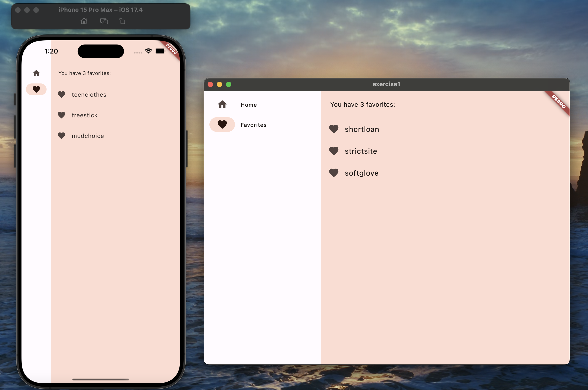

# exercise2

### Your First Flutter App

https://codelabs.developers.google.com/codelabs/first-flutter-app-pt1/#0

Try above two examples for Desktop and Web platforms as well (this requires students to research on their own about using Flutter code to compile as Web and Desktop apps based on reference links mentioned below).

Ref: https://flutter.dev/desktop and Building a web application with Flutter - Flutter,  https://flutter.dev/web

### Output on iOs and Chrome:
